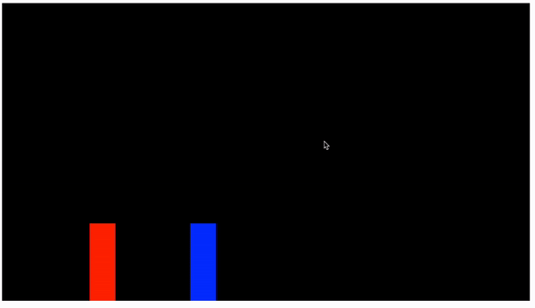

# Javascript 2D Retro Fighting Game!

This template was made by following a [YouTube Tutorial](https://www.youtube.com/watch?v=vyqbNFMDRGQ&ab_channel=ChrisCourses) by Chris Courses.         
I highly recommend checking out his tutorial and other work.        
[Chris Courses' Website](https://chriscourses.com/courses)         
[Chris Courses' Github](https://github.com/chriscourses/fighting-game)         

Play the game here: [Finished Demo](https://chriscourses-fighting-game.netlify.app/)            

This app uses basic HTML, CSS and Javascript.         
Libraries:       
    [GSAP](https://greensock.com/gsap/)      
    [Google Fonts](https://fonts.google.com/)      
    [Google Drive assets](https://drive.google.com/drive/folders/1569Y7WYX-aQf6LKstJtpuWQD0ylWxZ4P)      
    

### Finished preview

### Early preview

